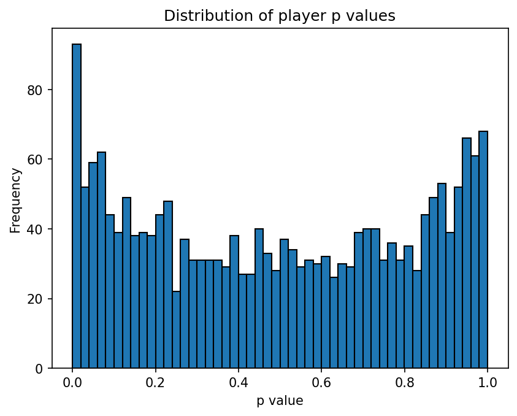
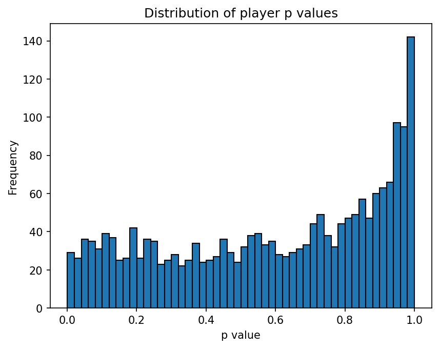

# Probability Simulations

Python simulations of problems in probability and game theory, with results compared against theory where a closed form exists.

## 1. El Farol Bar problem: an evolutionary minority game

### Background

I first came across this model in Neil Johnson's *Simply Complexity: A Clear Guide to Complexity Theory*. The book describes a population that splits into extreme strategies, with each player predicting the next outcome from a "crib sheet" of past patterns. I built the model to see whether the finding holds up and what actually drives it.

### Model

Each round, *N* = 2,000 agents independently decide whether to go to a bar with capacity *cN*. Going is the right choice if attendance is at most *cN*; staying home is right if the bar is crowded. Because the "right" side is whichever side ends up in the minority (relative to capacity), there is no strategy everyone can follow successfully.

- **Shared forecast.** The outcome history is stored as a binary sequence (1 = going was right). The forecast takes the last *m* outcomes, finds the most recent earlier occurrence of that length-*m* pattern, and predicts the outcome that followed it. If the pattern has never occurred, the forecast is a fair coin.
- **Agent strategy.** Agent *i* has a parameter *p<sub>i</sub>* ∈ [0, 1]: with probability *p<sub>i</sub>* they act on the forecast, otherwise they do the opposite. Agents with *p* ≈ 1 are followers, *p* ≈ 0 contrarians, *p* ≈ 0.5 effectively random.
- **Scoring and evolution.** Each round an agent scores +1 for being on the right side and −1 otherwise. When an agent's cumulative score reaches −5, they discard their strategy: *p<sub>i</sub>* is redrawn from U(0, 1) and the score resets to 0.
- **Measurement.** After *R* = 5,000 rounds, I record the distribution of *p*. With no selection, *p* stays uniform, so 10% of agents would fall in each tail (*p* < 0.1 and *p* > 0.9) and the mean would be 0.5.

| File | Memory *m* | Capacity *c* |
|---|---|---|
| `el_farol.py` | 5,000 (equal to *R*, so no pattern ever matches: the forecast is effectively a fair coin) | 50% |
| `el_farol_small_m.py` | 2 | 60% |

### Results

My first two runs changed both memory and capacity at once, so I ran all four combinations to separate their effects. Figures are averages over 5 runs per setting.

| Forecast | Capacity | *p* < 0.1 | *p* > 0.9 | Mean *p* | Rounds crowded |
|---|---|---|---|---|---|
| Random | 50% | 15% | 15% | 0.50 | 49% |
| Random | 60% | 8% | 8% | 0.50 | 1% |
| Memory (*m* = 2) | 50% | 15% | 16% | 0.50 | 49% |
| Memory (*m* = 2) | 60% | 7% | 23% | 0.60 | 25% |
| *Uniform baseline* | | *10%* | *10%* | *0.50* | |

**Symmetric capacity produces self-segregation.** At 50% capacity, about 31% of agents end up with extreme strategies (run-to-run spread under 1 percentage point), against 20% expected by chance, and the distribution stays symmetric (histogram below). Intermediate strategies are weeded out, consistent with the self-segregation result known from the evolutionary minority game.



**Memory alone does nothing at symmetric capacity.** With *c* = 50%, the *m* = 2 forecast gives the same result as a coin. The outcome sequence has no exploitable structure, so remembering it doesn't help.

**Memory pays off only when capacity is asymmetric.** At 60% capacity, going is usually right, and the memory forecast learns this regularity. Following it pays, so the mean of *p* rises to 0.60 and 23% of agents become strong followers. The effect limits itself: as followers grow in number they overfill the bar, which is then crowded in about a quarter of rounds.



With a random forecast at 60% capacity, average attendance (about 50%) stays below capacity, so the bar is almost never crowded and there is no systematic selection on *p*.

### Does the crib sheet matter?

In the book, players make their predictions using crib sheets, so I tested whether the pattern-matching memory plays any role. I varied the memory length *m*, where *m* = 0 means simply predicting the same outcome as last round. Figures are averages over 5 runs.

| Memory *m* | 50%: tails (*p* < 0.1 / *p* > 0.9) | 50%: mean *p* | 60%: tails | 60%: mean *p* |
|---|---|---|---|---|
| 0 | 16% / 15% | 0.50 | 7% / 23% | 0.60 |
| 1 | 16% / 15% | 0.50 | 7% / 23% | 0.60 |
| 2 | 15% / 16% | 0.50 | 7% / 23% | 0.60 |
| 3 | 15% / 15% | 0.50 | 7% / 22% | 0.60 |
| Random (shared coin) | 15% / 15% | 0.50 | 8% / 8% | 0.50 |

**Memory length makes no difference.** Every *m* from 0 to 3 gives the same result at each capacity. The crib sheet's pattern-matching is not what drives the behaviour.

To find out what does, I ran one more control at 50% capacity in which each agent receives their **own** independent random forecast rather than a shared one. The polarisation disappears completely: the tails return to 10% / 10%, matching the uniform baseline.

### Conclusions

1. **Polarisation requires a shared signal, not a clever one.** When everyone reacts to the same forecast, agents form two opposing camps (followers and contrarians), and the minority-game payoff weeds out the middle. What the forecast says is irrelevant: a shared coin flip works just as well as pattern-matching.
2. **The shift towards following comes from asymmetric capacity.** At 60% capacity, any forecast built from past outcomes, even "same as last time", picks up that going is usually right, so following pays. A random forecast carries no such information.
3. **The crib sheet is a red herring in this model.** Its memory length has no measurable effect. This echoes a known result in the minority game literature: replacing the real history with a random one changes surprisingly little (Cavagna, *Physical Review E*, 1999).

## 2. Other simulations

**| File | Problem | Simulation | **
|---|---|---|---|
| `monte_carlo.py` | Estimate π from the fraction of random points in the unit square that land inside the quarter circle (10⁶ points) | ≈ 3.141 | 
| `pokemon.py` | Coupon collector: expected packs to collect all *n* = 10 cards (10⁵ trials) | ≈ 29.29 |
| `random_walks.py` | Simple symmetric random walk, 100 steps | One sample path |

## Running

```
pip install matplotlib
python el_farol.py
```

To reproduce the other two settings, change `m` and `limit` at the top of either El Farol script.
